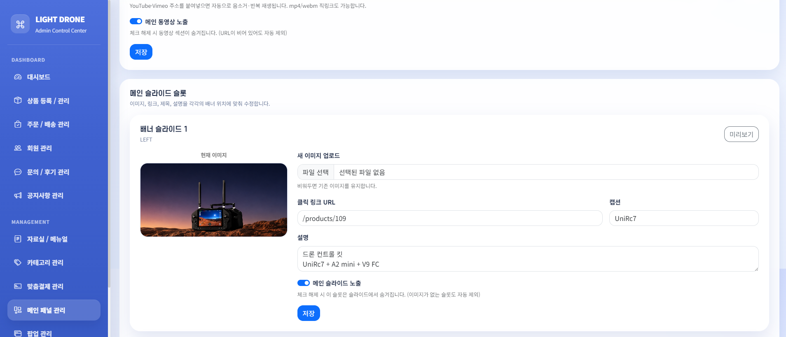
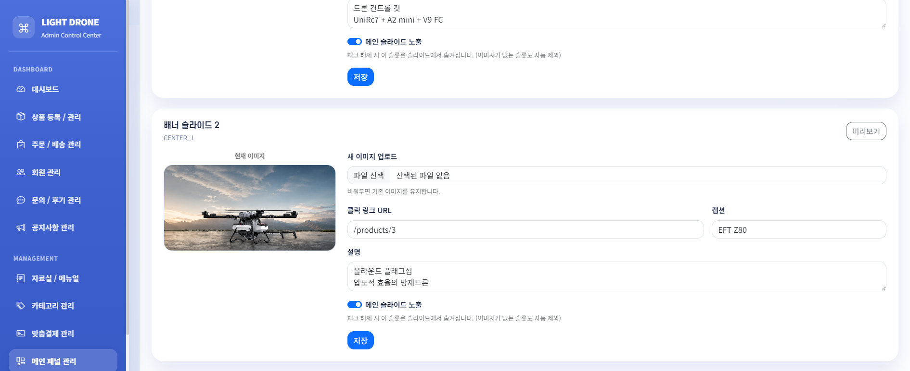
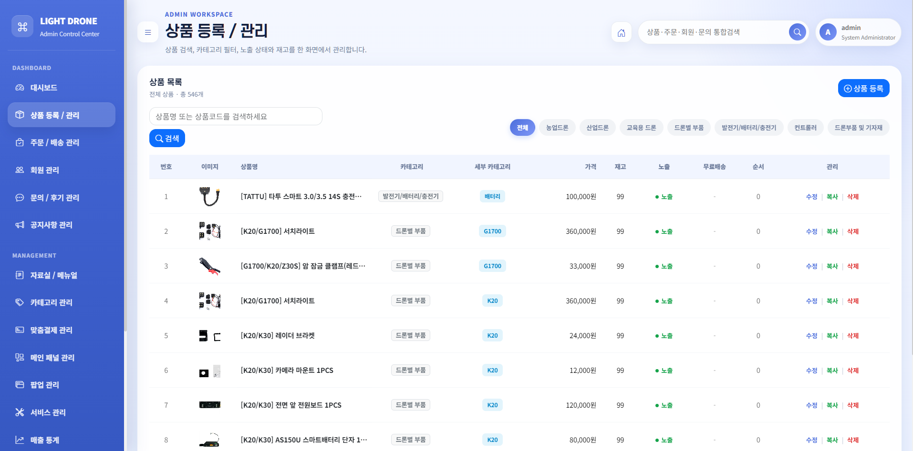
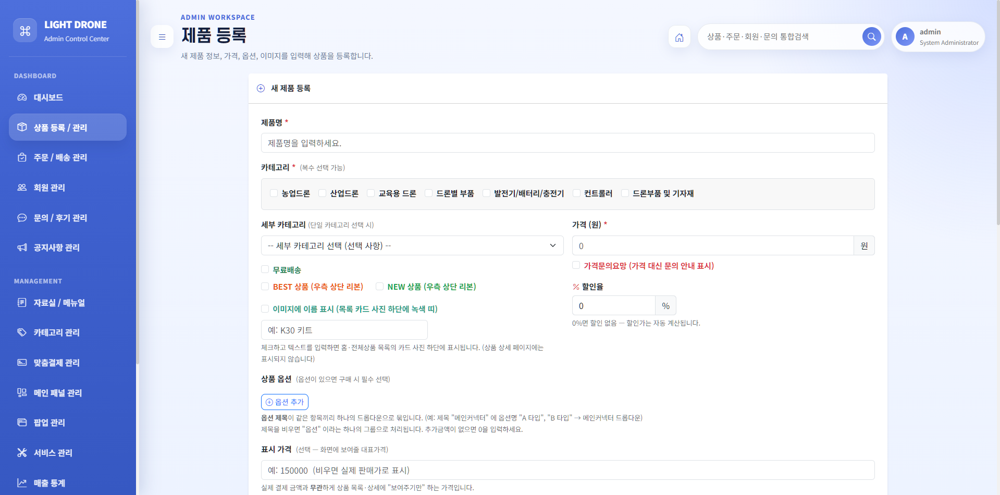
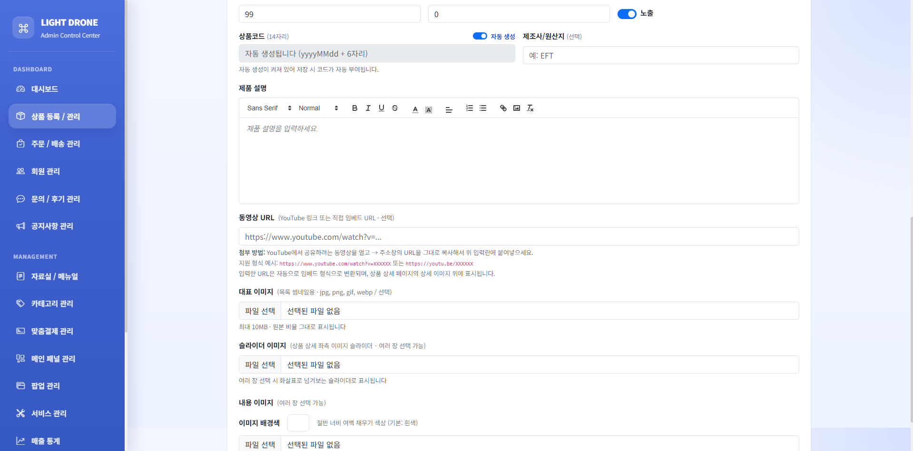
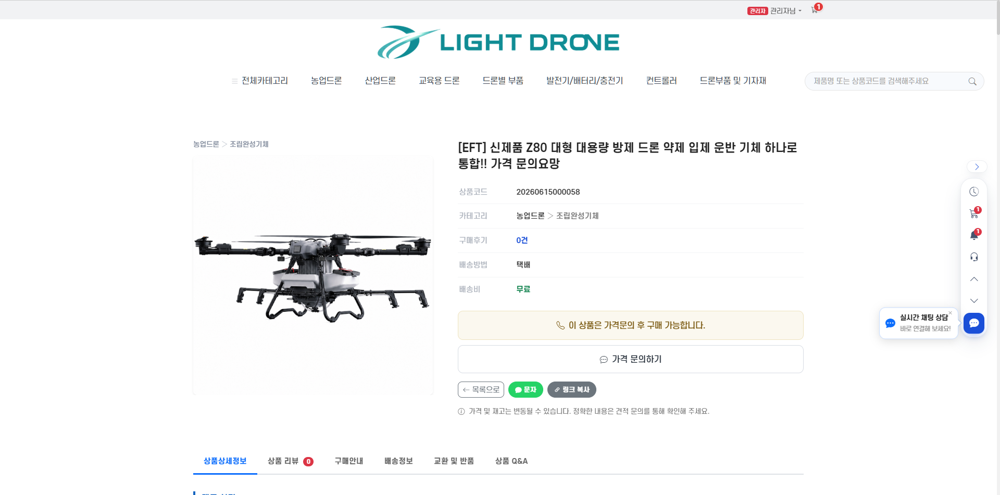
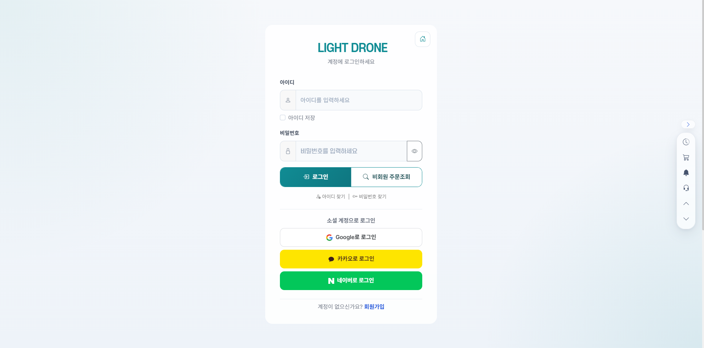
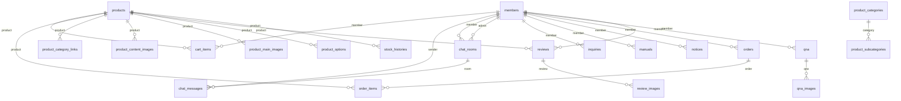

# LightDrone

드론·부품 판매 쇼핑몰 [lightdrone.co.kr](https://lightdrone.co.kr)의 소스 저장소.
실제 운영 중인 서비스로, 상품·주문·결제·회원·관리자 콘솔·모바일 UX·SEO까지 운영에 필요한 기능을 단계적으로 고도화했다.

이 저장소는 공개용 스냅샷이며, 내부 운영 문서와 배포 스크립트가 포함된 개발 히스토리(커밋 340여 개)는 비공개 저장소에서 관리한다.

| | |
|---|---|
| 서비스 | 드론·부품 판매 B2B/B2C 쇼핑몰 (운영 중) |
| 기간 | 2026.05 ~ 진행 중 |
| 규모 | 테이블 29개 · 엔드포인트 190여 개 · 통합 테스트 196건 |
| 스택 | Java 21 (빌드 JDK 25) · Spring Boot 3.4 · Spring Security · Thymeleaf · JPA · PostgreSQL · Flyway · Toss Payments · OAuth2 · Coolsms · Brevo · WebSocket |

## 배경

기존 사이트는 오래된 PHP 기반이라 입력값 검증 등 보안 측면과 기능 확장에 한계가 있었다. 운영 중인 사이트를 중단 없이 유지하면서 인증·권한·결제·상품·관리자 기능을 Spring Boot 기반으로 재구축했다.

## 스크린샷


*홈 화면 — 히어로 슬라이드·퀵메뉴·메인 동영상 구간. 슬라이드 구성은 관리자 콘솔에서 직접 관리한다.*

| 관리자 — 홈 패널 관리 | 설정이 반영된 홈 화면 |
|---|---|
|  |  |

*관리자에서 슬라이드의 이미지·캡션(UniRc7)·설명·링크를 설정하면(좌) 홈 히어로에 코드 수정 없이 그대로 반영된다(우).*


*슬롯별 이미지 업로드·클릭 링크·캡션·노출 토글 — 슬라이드 2(EFT Z80) 설정 화면.*


*관리자 상품 관리 — 검색·카테고리 필터, 노출 상태·재고·정렬 순서를 한 화면에서 관리.*


*상품 등록 — 카테고리 복수 선택, BEST/NEW 리본, 할인율, 상품 옵션 구성.*


*상품 등록 — 상품코드 자동 생성, 리치 에디터 설명, 동영상 URL, 대표·슬라이더·내용 이미지 업로드.*


*상품 상세 — 가격문의 상품은 구매 버튼 대신 문의 흐름으로 전환된다.*


*상품 상세 콘텐츠 — YouTube 동영상 임베드와 상세 이미지 영역.*


*로그인 — 폼 로그인, 비회원 주문조회, Google·Kakao·Naver 소셜 로그인.*

## 주요 기능

**상품·카테고리**
- BEST/NEW/품절/할인 리본, 할인율·도매회원가 분리 표시
- 카테고리별 메인 배너, 카테고리명 변경 시 상품 연결 자동 동기화
- 공급사 상품 JSON 번들 일괄 import — 상품명·세부카테고리 기준 중복 판정, 반복 실행 가능(멱등)

**주문·결제 (Toss Payments)**
- 결제 승인 멱등 처리: 동일 결제키 재요청은 `ALREADY_CONFIRMED`로 구분해 중복 확정·중복 SMS 차단
- 승인·취소 요청에 `Idempotency-Key`, 응답 금액·주문번호 대조 후 확정
- Webhook은 본문을 신뢰하지 않고 Toss 원장 재조회로 동기화, CSRF 예외는 해당 경로 하나로 한정
- 전체취소 성공 확인 후에만 재고 복원, 결제 대기 주문 만료 처리, 맞춤결제 링크

**회원·알림**
- Google / Kakao / Naver OAuth2 로그인
- 회원 등급별 상시 할인율 — 화면 표시와 장바구니·주문 금액 계산에 동일 적용
- 주문·문의·답변 SMS 알림, 인증번호 발송 횟수 제한

**관리자 콘솔**
- 상품·주문·회원·문의·후기·공지·자료실·팝업 통합 관리
- 매출 통계, CSV 내보내기, 재고 알림, 관리자 활동 로그, 통합검색
- 주문 인쇄(주문내역서·거래명세서 등 5종), 고객용 양식에는 관리자 메모·결제키 미노출

**CS 운영**
- 1:1 실시간 상담(WebSocket) — 종료된 상담과 탈퇴 회원의 상담도 이력으로 조회
- 문의 처리 상태(접수/처리중/답변완료/보류)와 담당자 배정으로 중복 대응 방지
- 재고 입출고 이력 — 주문 차감·취소 복원·수동 조정을 사유와 함께 기록해 재고 변동 추적

**홈 패널 관리**
- 홈 히어로 슬라이드 6개 슬롯(좌·중앙 1~3·우·추가 슬라이드)을 코드 수정 없이 관리자 콘솔에서 구성
- 슬롯별 이미지 업로드·클릭 링크·캡션·설명 문구·노출 토글, 저장 즉시 홈 화면 반영
- 메인 동영상 슬롯 — YouTube·Vimeo·mp4 링크 등록과 노출 제어, 이미지 없는 슬롯은 슬라이드에서 자동 제외

**보안·배포**
- 모든 시크릿 환경변수 외부화, 배포 JAR에 비밀값 패턴이 남으면 빌드를 실패시키는 `verifyNoSecretsInJar` 태스크
- 통합 테스트 196건 — 권한·CSRF·리소스 소유권, 결제 승인/취소 멱등, 주문 재고 정합성, 화면 렌더링
- jsoup 기반 입력 새니타이징, 업로드 파일 시그니처 검증
- Flyway 마이그레이션 (운영 `ddl-auto=validate`)

## 데이터 모델

테이블 29개, 외래키 23개. 아래는 관계로 연결된 테이블만 추린 개요이며, 실제 운영 스키마에서 추출했다.



| 도메인 | 주요 테이블 |
|---|---|
| 회원·등급 | `members`, `business_grade_policy` |
| 상품·카테고리·재고 | `products`, `product_options`, `product_categories`, `stock_histories` |
| 주문·결제 | `orders`, `order_items`, `cart_items`, `custom_payments` |
| 게시판·콘텐츠 | `notices`, `qna`, `reviews`, `manuals`, `support_videos` |
| 고객 응대 | `inquiries`, `chat_rooms`, `chat_messages` |
| 운영·로그 | `activity_logs`, `visitor_logs`, `popups`, `home_panel_settings` |

**스냅샷 컬럼을 둔 이유.** 주문 항목은 상품을 참조하면서도 주문 시점의 상품명·가격을 따로 저장한다. 상품이 수정·삭제돼도 과거 주문서의 내용이 바뀌면 안 되기 때문이다. 같은 이유로 상담 기록은 회원 탈퇴 시 개인정보(회원 FK)만 끊고 이름 스냅샷과 대화 내용을 남기며, 재고 이력도 상품 삭제 후 상품명이 남도록 했다.

## 기술적 의사결정

**운영 데이터 위에서의 스키마 변경.** 기능 추가 대부분이 DB 컬럼·관계 변경을 수반했고, 기존 데이터에 기본값이 없어 장애로 이어질 수 있었다. Flyway로 변경 이력을 파일로 관리하고 운영 환경을 `validate`로 전환해, 기존 데이터를 깨뜨리지 않는 확장을 원칙으로 삼았다.

**결제 콜백과 Webhook의 동시 도착.** 같은 결제가 두 번 확정되거나 알림이 중복 발송될 수 있는 구조를 멱등 처리와 Toss 원장 조회 기반 보정으로 해결했다. 성공 화면보다 주문 상태와 결제 원장의 일치를 우선 기준으로 잡았다.

**카테고리명 변경 시 상품 실종.** 이름 기반 연결 탓에 카테고리명을 바꾸면 기존 상품이 조회에서 빠졌다. 변경 시 상품 참조를 함께 갱신하고 메인·목록·필터의 조회 기준을 통일했다.

## 실행

로컬 PostgreSQL과 JDK 25가 필요하다(Gradle 툴체인 기준). 바이트코드는 Java 21로 컴파일한다.

`application.yml`에는 비밀값이 없으며 모든 시크릿은 환경변수로 주입한다. 유일하게 기본값이 들어 있는 `KAKAO_JS_KEY`는 브라우저에 노출되는 것을 전제로 하는 클라이언트 키로, 실제 보호는 Kakao 콘솔의 도메인 등록으로 이뤄진다.

```bash
# 방법 A — 로컬 설정 파일 (권장)
cp src/main/resources/application-local.yml.example src/main/resources/application-local.yml
./gradlew bootRun --args="--spring.profiles.active=local"

# 방법 B — 환경변수 직접 주입
DB_PASSWORD=<로컬 DB 비밀번호> ./gradlew bootRun
```

`http://localhost:8081`에서 확인할 수 있다. `DB_PASSWORD`만 필수이며, 나머지 키는 미설정 시 해당 기능(SMS·결제·소셜 로그인·메일)만 비활성화된다.

| 환경변수 | 용도 |
|---|---|
| `DB_PASSWORD` (필수) / `DB_URL` / `DB_USERNAME` | DB 접속 |
| `TOSS_CLIENT_KEY` / `TOSS_SECRET_KEY` | 토스페이먼츠 결제 |
| `GOOGLE_CLIENT_ID·SECRET` / `KAKAO_CLIENT_ID·SECRET` / `NAVER_CLIENT_ID·SECRET` | 소셜 로그인 |
| `SMS_API_KEY` / `SMS_API_SECRET` / `SMS_SENDER` / `ADMIN_PHONES` | Coolsms 문자 발송 |
| `BREVO_API_KEY` / `MAIL_SENDER_EMAIL` | 이메일 발송 |
| `KAKAO_JS_KEY` | 카카오톡 공유 (클라이언트 키) |

## 배포

운영 프로파일(`SPRING_PROFILES_ACTIVE=prod`)은 로깅·캐시·세션 쿠키·Flyway baseline 등 비밀값 없는 오버라이드만 담는다. 운영 시크릿은 배포 환경의 환경변수로만 주입하며, 빌드 시 `verifyNoSecretsInJar`가 배포 JAR의 비밀값 포함 여부를 검사해 위반 시 빌드를 중단시킨다.

```bash
./gradlew build   # test + verifyNoSecretsInJar 포함
```
